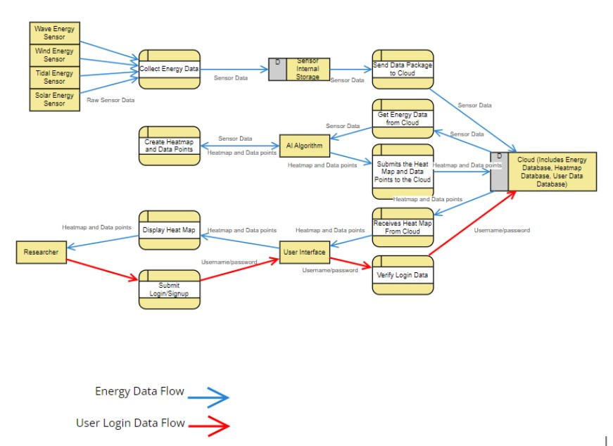

# Requirements-Engineering

This is the final requirement specification document for an example device that helps gather, control, and display data for energy harvesting from marine renewable energy systems using AI. Below is some of the images from the pdf.

A prototype of the dashboard UI, displaying energy production, online systems, total energy produced, as well as sensor data.

A deeper view into how each part of the overall system interacts and communicates together.
